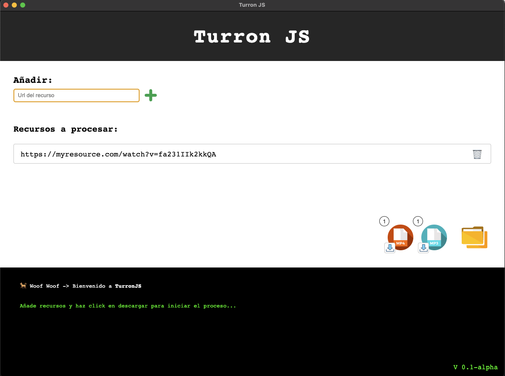

# TurronJS 🐕 

### What is TurronJS?

TurronJs is a simple user interface [electronJS](https://github.com/electron/electron)  based to handle [yt-dlp](https://github.com/yt-dlp/yt-dlp) execution combined with [ffmpeg](https://github.com/FFmpeg/FFmpeg) actions. It was created as a personal tool with no other purposes & you can use it completely free.

### What can do?

It can handle resources like you usually do with yt-dlp using a user interface with 2 options available (audio only or video).

### Compatibility

Can compile working builds for macOS & win32 platforms with simple scripts you found on package.json. 

### How it works?

TurronJS comes from previous versions directly written for bash & powershell (TurronSH).

**This software only add the user interface to handle resources & execs the original .sh & .ps1 scripts in background when it runs**.

Each one of the original scripts performs similar actions based on SO.

1. Check required dependencies & download if not present

    1.1. **Win32 systems**
        -  Install [chocolatey](https://github.com/chocolatey/choco)
        -  Install [yt-dlp](https://github.com/yt-dlp/yt-dlp)
        -  Install [ffmpeg](https://github.com/FFmpeg/FFmpeg)

    1.2. **MacOS systems**
        -  Install [brew](https://github.com/Homebrew/brew)
        -  Install [yt-dlp](https://github.com/yt-dlp/yt-dlp)
        -  Install [ffmpeg](https://github.com/FFmpeg/FFmpeg)

2. Check the output dir & creates if not exists
3. Exec the original yt-dlp on each previously added sources

### Developer usage
    1. npm i
    2. npm run pack:osx ( or pack:win32 on win32 based systems )
    3. You have your working build in /dist

### Limitations

Actually always downloads the max quality found on resource by default and there is no gui option to chage this (you can tweak the original scripts in project & edit all related details, but default config is the one that was previously needed for personal requeriments in most of use cases).

There is no warranty with this tool, was originally created for personal needs & wanted to publish free in case it helps someone. 

**Signed by** 🐾 Woof Woof.
